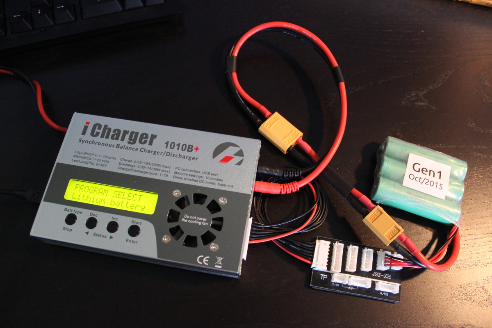

# iChargerMon

A tool for interacting with the iCharger series of RC hobby chargers.

## Why?

I wanted to be able to remotely monitor an iCharger. I sometimes use it to
boost up the battery in my car and thought it would be nice to see when it is
done.

Having this built in C/C++ means that the dependencies are minimal and it can
run on old (Pentium III ToughBook), cheap (RaspberryPi, Beaglebone) and
weird (the wifi router in my garage) hardware.

## Compatiblity

This tool has been tested under the following configurations:

* Linux
  * iCharger 1010B+
* Mac OS
  * iCharger 1010B+

## Usage

This tool will open the device and read logs as fast as it can while logging
them to the console. The iCharger emits a packet once per second or so at 9600
8N1 baud.

The tool defaults to /dev/ttyUSB0 and you can optionally specify an alternate
device file path on the command line.

    ichargermon [device_file]

## Future work

* Add mode support to the output (ie: Charging, discharging, etc.).
* Add an argment parser
  * Add a usage string, printed with -h|--help
* Consider other iChargers
  * The 4010 duo uses a USB endpoint via MODBUS and supports remote control
  * It would be nice if ichargermon eventually supported all iChargers
* Improve the Makefile
  * It works, but it doesn't do anything super helpful (ie: clean).
* Consider supporting Windows users

## Example Output

Here are some example outputs and pictures for fun.

### Charging a 3S1P Lithium Ion Pack

    Input voltage:    15.176V
    Battery voltage:  11.867V
    Battery amps:     1.000A
    Internal temp:    28.200C
    Cell 0 voltage:   3.954V
    Cell 1 voltage:   3.949V
    Cell 2 voltage:   3.954V
    Cell 3 voltage:   0.000V
    Cell 4 voltage:   0.000V
    Cell 5 voltage:   0.000V
    Cell 6 voltage:   0.000V
    Cell 7 voltage:   0.000V
    Cell 8 voltage:   0.000V
    Cell 9 voltage:   0.000V

### Charging a 10S6P Lithium Ion Pack

    Input voltage:    15.163V
    Battery voltage:  40.165V
    Battery amps:     0.990A
    Internal temp:    30.300C
    Cell 0 voltage:   4.009V
    Cell 1 voltage:   4.010V
    Cell 2 voltage:   4.012V
    Cell 3 voltage:   3.998V
    Cell 4 voltage:   4.014V
    Cell 5 voltage:   4.014V
    Cell 6 voltage:   4.014V
    Cell 7 voltage:   4.014V
    Cell 8 voltage:   4.017V
    Cell 9 voltage:   4.019V

### Charging a BMW 435i Lead Acid (AGM) Car Battery

    Input voltage:    15.102V
    Battery voltage:  14.330V
    Battery amps:     10.000A
    Internal temp:    27.200C
    Cell 0 voltage:   0.000V
    Cell 1 voltage:   0.000V
    Cell 2 voltage:   0.000V
    Cell 3 voltage:   0.000V
    Cell 4 voltage:   0.000V
    Cell 5 voltage:   0.000V
    Cell 6 voltage:   0.000V
    Cell 7 voltage:   0.000V
    Cell 8 voltage:   0.000V
    Cell 9 voltage:   0.000V

